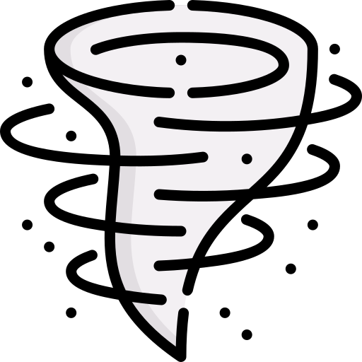

<br />
<p align="center">
  <a href="https://github.com/samogod/tornado">
    
  </a>

  <h3 align="center">tornado</h3>

  <p align="center">
    anonymously reverse shell over onion network using hidden services without portfortwarding     
    <br />
    <a href="https://github.com/samogod/tornado"><strong>Explore the docs</strong></a>
    <br />
    fully undetectable reverse shell</a>
    ·
    <a href="https://github.com/samogod/tornado">View Demo</a>
    ·
    bulletproof anonymity</a>  
    
  </p>
</div>
  </p>
</p>

---

<div align="center">
  
</div>

<details open="open">
  <summary>Table of Contents</summary>
  <ol>
    <li>
      <a href="#what-is-tornado">What is tornado?</a>
    </li>
    <li><a href="#built-with">Built With</a></li>
    <li>
      <a href="#getting-started">Getting Started</a>
      <ul>
        <li><a href="#installation">Installation</a></li>
      </ul>
    </li>
    <li><a href="#usage">Usage</a></li>  
    <li><a href="#roadmap">Roadmap</a></li>
    <li><a href="#contributing">Contributing</a></li>
    <li><a href="#license">License</a></li>
    <li><a href="#disclaimer">Disclaimer</a></li>
  </ol>
</details>

> If you are having any operating system compatiblity issue, let me know. I will try to fix as soon as possible so let's explore the docs.

## What is tornado?

Tornado is implements tor network with metasploit-framework tool and msfvenom module, you can easily create hidden services for your localhost .onion domain without portforwarding. If you have experience different remote administration tools, probably you know you need forward port with virtual private network or ngrok but in this sense with tornado, the tor network offers the possibility of making services in a machine accessible as hidden services without portforwarding, by taking advantage of the anonymity it offers and thereby preventing the real location of the machine from being exposed.  

tornado can do
+ create hidden service with tor network
+ generate cross platform msfvenom payload with fully undetectable shellcode execution not shikata_ga_nai things
+ hidden service becomes available outside tor network and ready to reverse shell connection

A word of caution regarding the use of Tor2Web and the onion network: disregarding security measures can be perilous. From the standpoint of a potential victim, Tornado might not be secure; Tor's primary aim is to enable anonymous connections free from surveillance. Utilizing Tor2Web to access services over the clearnet, even with the use of HTTPS, can significantly undermine the privacy and security efforts the Tor network strives to provide.

### Built With

* [Tor](https://www.torproject.org)
* [Metasploit](https://www.metasploit.com/)
* [Tor2Web](https://www.tor2web.org/)


## Getting Started

To get a local copy up and running follow these simple steps.  

### Installation
#### Linux
1. Clone the repo
   ```bash
   $ git clone https://github.com/samogod/tornado.git
   ```
2. Setup tornado with requirement packages.
   ```bash
   $ sudo python3 setup.py install
   ```
3. Run it with sudo permissions.
   ```bash
   $ sudo tornado
   ```

#### Windows
1. Clone the repo
  ```
  git clone https://github.com/samogod/tornado.git
  ```

2. Setup tornado with requirement packages.
  ```
  python setup.py install
  ```

3. Run it

  <!-- In Windows there is no need for this kind of things to have admin privileges-->
  ```
  python -m tornado
  ```

### Usage
#### Linux
* Run tornado with sudo permissions & -start flag.
   ```bash
   $ sudo tornado -start
   ```

#### Windows
* Run tornado with -start flag
  ```
  python -m tornado -start
  ```

## Roadmap

- [ ] Integrity to Windows operating system
- [ ] Reverse shell without Tor2web - The working mechanism is inject payload to tor expert bundle .exe with special torrc files.  

## Contributing

Contributions are what make the open source community such an amazing place to be learn, inspire, and create. Any contributions you make are **greatly appreciated** especially <a href="#roadmap">Roadmap</a> check this to-do list.  

1. Fork the Project
2. Create your Feature Branch
`git checkout -b feature/feature`
3. Commit your Changes
`git commit -m 'Add some feature'`
4. Push to the Branch 
`git push origin feature/feature`
5. Open a Pull Request

## License

Distributed under the GNU License.  
See `LICENSE` for more information.

## Disclaimer

This tool is only for testing and can only be used where strict consent has been given. Do not use it for illegal purposes! It is the end user’s responsibility to obey all applicable local, state and federal laws. I assume no liability and are not responsible for any misuse or damage caused by this tool and software.

<!---/samogod/samet-gozet/-->
